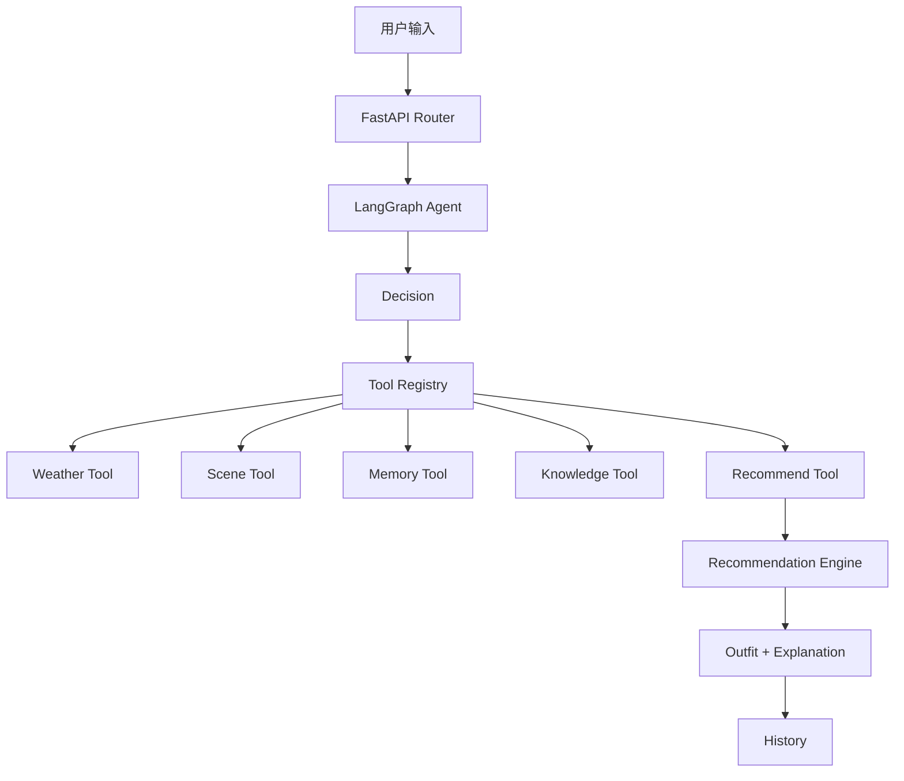

# ASRA

AI Styling Recommendation Assistant

ASRA 是一个基于 LangGraph 的 AI 穿搭推荐 Agent。用户通过自然语言描述城市、场景、风格和单品约束，ASRA 会动态决定调用天气、场景、记忆、知识和推荐工具，生成可解释的穿搭方案。

## 项目架构



Agent 根据 `tool_plan` 按顺序动态调用工具，不依赖固定流程。

## 技术栈

- Python 3.11
- FastAPI
- SQLAlchemy
- SQLite
- LangGraph
- JWT 鉴权
- Open-Meteo 天气接口
- Ollama 本地视觉模型：`qwen2.5vl:7b`
- Pydantic
- Alembic
- pytest

## 核心流程

1. 解析用户意图
2. 识别城市、场景、风格、季节
3. 读取用户画像、历史和反馈
4. 获取天气和穿搭知识
5. 生成候选穿搭
6. 应用硬约束
7. 应用场景和记忆软评分
8. 生成解释并保存历史

例如：

```text
明天面试，只推荐衬衫和裤子，不要黑色
```

会先解析出：

```text
occasion = 面试
required = [衬衫, 裤子]
excluded = [黑色]
```

再进入推荐引擎，而不是直接让模型自由发挥。

## 关键设计问题

### 为什么不全部交给 LLM

穿搭推荐需要可复现、可测试、可解释的约束。

- 硬约束必须确定，不能依赖模型心情
- 推荐引擎需要稳定评分
- 没有 LLM Key 时仍可运行
- 便于写回归测试

### Rule + LLM 为什么混合

LLM 负责理解自然语言和场景，规则负责执行硬约束和归一化。

- LLM：意图识别、场景理解、自然语言解释
- Rule：候选过滤、槽位限制、颜色排除、风格硬过滤
- Fallback：无 LLM 时使用确定性规则

### Vision 如何接入

用户上传衣物图片后：

1. 调用本地 Ollama 视觉模型
2. 模型返回结构化 JSON
3. 归一化为合法 category / style / color / tags
4. 写入衣柜

示例模型输出：

```json
{
  "name": "高领拉链运动夹克",
  "category": "运动上衣",
  "style": "修身运动风",
  "style_tags": ["运动风", "休闲", "拉链"]
}
```

归一化后：

```json
{
  "name": "高领拉链运动夹克",
  "category": "上衣",
  "style": "运动",
  "style_tags": ["运动", "休闲"]
}
```

### Memory 如何工作

Memory 由三部分组成：

- UserProfile：长期偏好
- RecommendationHistory：最近推荐
- RecommendationFeedback：点赞 / 点踩

系统会区分：

- 长期偏好：`用户喜欢休闲风格`
- 当前请求：`今天只要上衣，要运动风`

当前请求约束在请求结束后清理，避免污染长期记忆。

## API 示例

### POST /agent/recommend

```json
{
  "query": "明天面试，只推荐衬衫和裤子，不要黑色",
  "city": "沈阳",
  "occasion": "面试"
}
```

返回结构：

```json
{
  "code": 200,
  "scene": {
    "scene_type": "面试",
    "style": "商务",
    "formality": 3
  },
  "recommendation": {
    "items": [
      {"name": "灰色衬衫", "slot": "上衣"},
      {"name": "灰色裤子", "slot": "裤子"}
    ],
    "summary": ["整体风格统一", "灰色配色协调"]
  },
  "memory": {},
  "knowledge_text": "",
  "explanation": ""
}
```

## 测试结果

```text
275 passed
```

覆盖范围：

- 意图解析
- 颜色和单品硬约束
- 风格冲突
- 场景解析
- 推荐引擎
- 图片识别归一化
- 聊天多轮记忆
- 前端渲染

## Agent 评估

ASRA 内置 Golden Set 评估用例，共 20 条，覆盖必选单品、排除单品、颜色硬约束、风格冲突、正式/商务/运动风格、长袖/短袖和户外场景。

运行评估：

```powershell
& '.\venv\Scripts\python.exe' scripts\evaluate_agent.py
```

当前结果：

```text
total_cases: 20
passed_cases: 20
intent_accuracy: 1.0
```

推荐结果指标可通过接口查看：

```text
GET /evaluation/metrics
```

当前指标由评估测试提供确定性基准：

| 指标 | 测试值 |
| --- | --- |
| 推荐成功率 | 0.9 |
| 约束满足率 | 0.9 |
| 风格命中率 | 1.0 |
| 无推荐原因分布 | `style_not_found: 1` |

说明：基准为 10 笔业务请求，其中 9 笔成功、1 笔运动风格无结果。旧版推荐历史没有 `constraints/outcome` 字段，接口只统计新版本产生的请求；随着新请求累积，`/evaluation/metrics` 会返回真实累计值。

### 关键样本验证记录

| 指标 | 验证结果 |
| --- | --- |
| 回归测试通过率 | 184/184 = 100% |
| 关键 Agent 测试通过率 | 4/5 = 80% |
| 硬约束满足率 | 4/5 = 80% |
| 风格命中率 | 4/5 = 80% |
| 推荐成功率 | 4/5 = 80% |
| 场景识别已验证样本 | 100% |
| 无推荐原因已验证样本 | 100% |


## 部署（Render）

ASRA 已提供 `Dockerfile` 和 `render.yaml`，可部署到 Render Free。

1. 确保代码已推送到 GitHub。
2. 在 Render 新建 Blueprint，选择 ASRA 仓库。
3. Render 读取 `render.yaml` 后自动创建 Web Service。
4. 首次启动后访问 `https://<服务名>.onrender.com/docs`。

推荐环境变量：

```text
VISION_ENABLED=false
DATABASE_URL=sqlite:////tmp/asra.db
SECRET_KEY=<由 Render 自动生成>
```

注意：免费实例使用 SQLite 时，数据会在实例重建后重置；需要持久化数据时改用 Render PostgreSQL。

## Demo

在线 API 演示（Render Free）：

<https://asra-8f01.onrender.com/docs>

> 免费实例首次访问可能需要等待冷启动；`docs/demo.gif` 可后续补充。

## 启动

```powershell
cd 你的项目目录
& '.\venv\Scripts\uvicorn.exe' backend.main:app --host 127.0.0.1 --port 8000 --reload --reload-dir backend --reload-dir database
```

打开：

```text
http://127.0.0.1:8000/docs
```

## 环境变量

```ini
SECRET_KEY=your_secret_key
DATABASE_URL=sqlite:///./asra.db
USE_WEATHER_API=true

VISION_ENABLED=true
VISION_BASE_URL=http://127.0.0.1:11434/v1
VISION_MODEL=qwen2.5vl:7b
VISION_API_KEY=ollama

LLM_API_KEY=
LLM_BASE_URL=https://api.openai.com/v1
LLM_MODEL=gpt-4o-mini
```

## 测试命令

```powershell
& '.\venv\Scripts\python.exe' -m pytest -q
```
